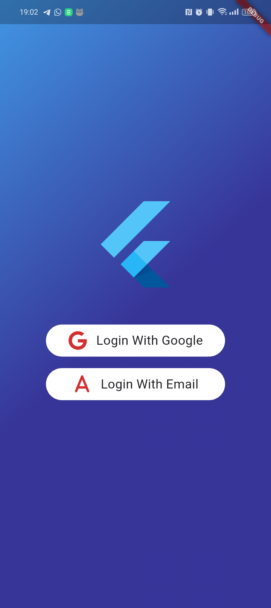

# EventsApp - Google Authentication

This project demonstrates how users of **EventsApp**, an app designed to organize and manage events, are authenticated using Google.

The database used for the app is **Supabase**, which handles both data storage and user authentication.

## Authentication Details

The procedures on which the proposed authentication is based can be found in the following resources:

- [Auth0](https://auth0.com/docs/quickstart/native/flutter/interactive);
- [Supabase Auth Documentation](https://supabase.com/docs/guides/auth)
- [Google OAuth 2.0 Documentation](https://developer.android.com/identity/sign-in/credential-manager-siwg?hl=it)
- [Flutter google_sign_in Library](https://pub.dev/packages/google_sign_in)

**Note:** Create a `.env` file to store the environment variables used by the app for authentication.

#### Example `.env` File:

```env
GOOGLE_CLIENT_ID=your_google_client_id
SUPABASE_URL=your_supabase_url
SUPABASE_KEY=your_supabase_key
AUTH0_CUSTOM_SCHEME=your_auth0_scheme
AUTH0_CLIENT_ID=your_auth0_id
AUTH0_DOMAIN=your_auth0_domain
```

## Android Configuration

In addition to setting up the `.env` file, you need to modify the following files for proper configuration:

1. **`android/build.gradle`**
2. **`android/app/build.gradle`**
3. **`android/app/src/main/AndroidManifest.xml`**

Follow the code examples provided in the project for the necessary changes.

### Adding `strings.xml`

You must also create or update the `strings.xml` file in the `android/app/src/main/res/values/` directory. The file should include the following content:

```xml
<resources>
    <string name="com_auth0_domain">your_auth0_domain</string>
    <string name="com_auth0_scheme">your_auth0_scheme</string>
</resources>
```

// TODO: specify why demo scheme

## Authentication Libraries

// TODO 

## Data Storage

All session data is saved in a JSON file located at the path `/data/user/0/EVENTSAPP_PACKAGE/app_flutter` on the device. This file is accessible through the `data_controller`.

## Application UI

The user interface (UI) of the application is intentionally simple, designed solely to demonstrate the app's functionality.

Below are some screenshots showcasing the app:

### Screenshots

1. **Login Screen**  
   
   

2. **Logout Screen**  
   
   

3. **Authenticaion**  
   

## Getting Started

This project is a starting point for a Flutter application.

A few resources to get you started if this is your first Flutter project:

- [Lab: Write your first Flutter app](https://docs.flutter.dev/get-started/codelab)
- [Cookbook: Useful Flutter samples](https://docs.flutter.dev/cookbook)

For help getting started with Flutter development, view the
[online documentation](https://docs.flutter.dev/), which offers tutorials,
samples, guidance on mobile development, and a full API reference.


